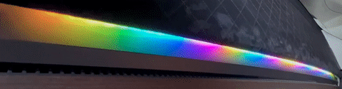

# TesLight

## Important Notes

Creating this project has taken a lot of my time, effort and money.
Nevertheless, I share it publicly with you.
You can use it for free, modify it and even sell it.
But please **don't steal** my work, be a little **respectful** and **give credits**.

Also, you should be careful when working on the project and especially your car.
Use this project at your own risk.

That said, I hope you have a lot of fun!
Thank you💖

## Beta Warning

Currently this project is still in a beta stage but we are slowly approaching a first release version.
Some bugs, crashes and missing documentation are to be expected.

## Introduction

TesLight is an open source ambient light system for cars that you can build by yourself.
Like the name implies, it was developed to integrate with Tesla cars with a focus on the Model 3 and Model Y.
However, it can also be used for other cars with some modifications.

The main feature of TesLight is to give zonal control over the ambient lighting in your car.
The zones are: the 4 doors, the dashboard and the center console.
Each zone can have a string of LEDs which TesLight can individually address.
In total it can give you control over hundreds of LEDs installed in your car.

You can choose between different algorithms to display static colors, gradients or even animations for each individual zone.
These animations, can be further configured using the browser-based user interface.

When TesLight is powered up, it will create a WiFi access point which you can use to connect your mobile device to.
Then you have access to the user interface via your browser to configure your ambient light.
This can be a one-time setup or you can play with different colors every day if you desire.

TesLight integrates seamlessly with OEM features and is capable of syncing system operation to locking/unlocking your car or adjusting the screen brightness.

You think "Wtf is she talking about? This girl is a potato."
And you would be right, I am a potato. But also maybe have a look at a few pictures.

(Oh really friend? You were supposed to look for typos, not call me a potato... Ahhh what ever..)

## Planning

It is recommended to read the [planning](documentation/planning.md) document before you start the project.
There are some important considerations and decisions you have to make first.
This will save you some trouble and makes it easier to buy the right parts.

## Part List

A list of required parts can be found [here](documentation/part-list.md).

## Build Guide

The build guide can be found [here](documentation/build.md).
