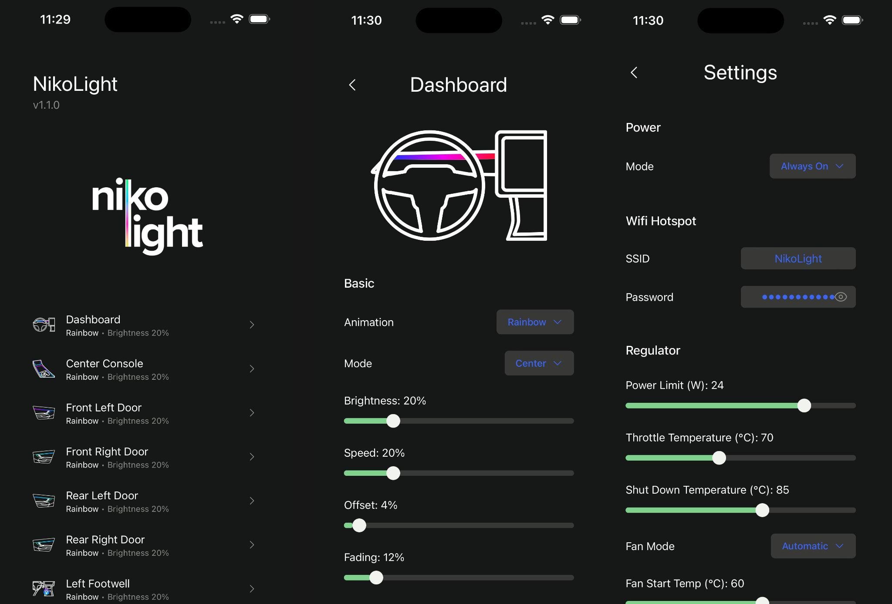

# TesLight

## Beta Warning

Currently, this project is still in a beta stage, but we are quickly approaching a first release version.
Some minor bugs and missing documentation are to be expected.

## Introduction

TesLight is an open source ambient light that you can build yourself.
The project is primarily aimed at people who are not looking for a ready-made solution and prefer to tinker, modify, extend and work on it as a community.
As the name suggests, the project was started primarily for Tesla vehicles.
The focus is on the Model 3 and Model Y.
However, it can also be used for other cars with some small modifications.

With TesLight you can control up tp 8 zones with a variable number of WS2812-type LEDs.
For example, the 4 doors, the center console, the footwell lights and a light bar under the dashboard.
In total, several hundred LEDs can be controlled individually.

Since there should be an easy way to control all these LEDs, there are many different effects for each zone.
These can display a simple color, color gradients or even animations in the individual zones.
Since the controller has a motion sensor, some effects are even interactive.
The effects are expandable in the future and can be adapted to your wishes over time.
Even fully customized animation are possible.
You can create these on your computer and play them back in the car.

TesLight can be easily integrated into your Tesla (and other cars).
There is a sensor that can be connected to the lighting around the footwell.
This way, TesLight switches on and off automatically when you open or lock the car.
It is also possible to regulate the brightness together with the factory-installed lights or via the display.
The controller is also expandable and could support additional hardware in the future.
For example, there could be a CAN adapter to get more information from the vehicle.
How relevant these extensions will be, depends a little bit on the community and the support I will receive.

Once built and installed, TesLight can be configured via a browser-based UI.
When starting the controller, a Wi-Fi hotspot is created to which you can connect to with basically any device.
The user interface can be accessed via a normal browser thanks to the integrated web server.
The project is therefore mostly platform-independent.

**Here is a short summary of the currently most interesting features:**

-  Individual control of each LED installed in the car
-  Hundreds of LEDs are possible
-  Compatible with all WS2812-type LEDs (and LEDs with the same protocol)
-  Fiber cables, light bars and normal LED strips are supported
-  Up to 8 individual zones
-  Currently 18 different effects that can be selected and further customized for each zone
-  Browser based user interface
-  Switching on/off as well as dynamic brightness via the existing lighting in the footwell
-  Rotation and acceleration sensors
-  Interactive effects
-  Light shows
-  Fully customized animations can be created on your PC (playback of fseq 1.0 files from [xLights](https://xlights.org/))
-  OTA (wireless) updates
-  Hardware is upgradeable via extensions in the future

## Some Videos and Pictures

(click to watch on YouTube)

(click to watch on YouTube)

## Planning

It is recommended to read the [planning](documentation/planning.md) document before you start the project.
There are some important considerations and decisions you have to make first.
This will save you some trouble and makes it easier to buy the right parts.

## Part List

A list of required and optional parts can be found [here](documentation/part-list.md).

## Build Guide

The build guide can be found [here](documentation/build.md).

## One request

Creating this project has taken a lot of my time, effort and money.
Nevertheless, I share it publicly with you.
You can use it for free, modify it and even earn a coffee by building the parts for other people.
But please **don't steal** my work silently, be a little **respectful** and **give credits**.
That's all I wish for.

Also, you should be careful when working on the project and especially your car.
I am not a professional electrical engineer and only doing this as a hobby on the side.
Use this project at your own risk.

That said, I hope you have a lot of fun and great experience with TesLight!
Thank you💖
