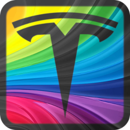

# TesLight

## Important Notes

Creating this project costs me a lot of time, work and money.
Nevertheless I share it publicly with you.
You can use it for free, modify it and even sell it.
But please **don't steal** my work, be a little **respectful** and **give credits**.

Also keep in mind that you should be careful working on the project and especially your car.
Use the project at own risk.

That said, I hope you have a lot of fun.
Thank you💖.

## Beta Warning

Currently this project is in a very early beta stage.
Some bugs are expected, the code is not polished and optimized, documentation is incomplete.

If you have some experience you can still build the project and use the basic features just like I do in my car.

Due to private reasons I was not able to proceed with the development like planed.
Nevertheless I will slowly continue the development to hopefully reach a first stable version soon.
For the same reason more advanced features like OTA updates, 3D visualisations, the ussage of the motion sensor and the lightshow are on pause.
I will hopefully come back to this in the future, when I feel better.  

## Introduction

TesLight is a open source ambient light system that you can build by yourself.
Like the name implies it was developed to integrate with Tesla cars with a focus on the Model 3 and Model Y.
Nevertheless it can also be used for other cars since it should be easy to do some modifications.

The main feature of TesLight is to act as a ambient light system and give you control over multiple zones in your car.
These zones are the 4 doors, the dashboard and the center console.
Each zone can have a string of LED's which TesLight can individually address. 
In total it can give you control over hundreds of LED's built into your car.

You can choose between different algortihms to display static colors, gradients or even animations for each individual zone.
These algorithms, or `animators`, can be further configured using the browser-based user interface.

When TesLight is powered up, it will create a WiFi access point which you can use to connect your mobile device to.
Then you have access to the user interface via your browser to configure your ambient light.
Depending on your wished this can be a one time setup or you can play with different colors every day.

Of course TesLight is also able to automatically turn on and off the lights when you unlock or lock your car.
This gives the whole system a more OEM like feeling.

You think "Wtf is she talking about"?
Maybe have a look at a few pictures.

## Planning

It is recommended to read the [planning](/documentation/planning.md) document before you start with the project.
There are some important considerations and decisions you have to make first.
This will save you some trouble and makes it easier to buy the right parts.

## Part List

Todo :(

## Build Guide

Todo :(
