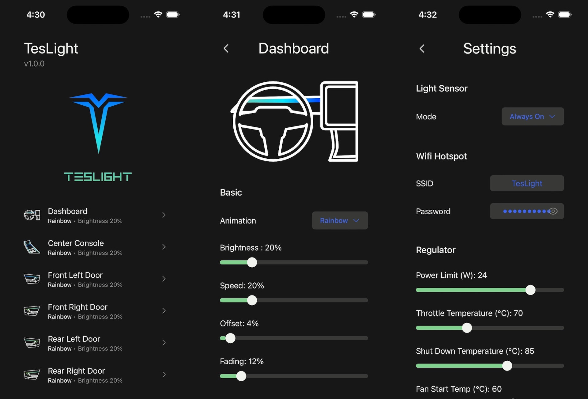

# NikoLight

## Disclaimer for Hardware 2.2

Currently I am rewriting the firmware from scratch including many improvements and new features.
The release was planned for Christmas 2023.
Even when many parts of the new firmware are already working, I am currently a little time limited and will not be able to finish it in time.
Instead, I added experimental support for the v2.2 hardware to the current firmware.
This does not come with all the new software and hardware features but it allows you to use the new (2.2) NikoLight boards with a significantly higher power output and the overall improved hardware.

The hardware version can be adjusted in the [SystemConfiguration.h](./mcu/include/configuration/SystemConfiguration.h).
Again, keep in mind that this experimental and there might be some hidden issues.

## Introduction

NikoLight is an open source ambient light that you can build and individualize yourself.
It was initially created with modern EV's in mind.
However, recent versions of the project are very flexible.
NikoLight can be used in almost any vehicle including cars, trucks, campers, boats, ...

The project was primarily made for people who are looking for something unique system that differs from boring ambient light systems that can be found all over the internet.
With NikoLight you can control up to 8 individual zones of WS2812-type LEDs.
For example, the 4 doors, the center console, the footwell lights and a light bar under the dashboard.
Each zone can have up to 250 LEDs which means there can be up to 2000 LEDs in total.
Every single LED can be addressed and individually controlled by the NikoLight board.
This allows to create a variety of beautiful effects.

Since there should be an easy way to control all these LEDs, there are many premade and highly configurable effects for each zone.
These can display a simple color, color gradients or moving animations in each zone.
Fully customized animation are possible as well and can be created on your computer.

The NikoLight board also comes with sensors and extensions.
These can be used to display special effects based on the motion of the vehicle or sound.
This allows to create very unique and interactive effects which makes NikoLight special.
The controller and all extensions can be updated at any time.
As a consequence all effects are expandable and new features can be added.

NikoLight can easily be integrated into your vehicle.
It offers a voltage sensor that can be used to turn the lights on or off.
This voltage sensor can be connected to any signal source of the vehicle.
This way, NikoLight switches on and off automatically when you open or lock the vehicle.
It is also possible to adjust the brightness together with the factory-installed lights or depending on the ambiente brightness.
Alternatively, the internal motion sensor or an external light sensor can be used to turn the controller on or off.

Once built and installed, NikoLight can be configured via a browser-based UI.
When starting the controller, a Wi-Fi hotspot is created, which you can connect to with any device.
The user interface can be accessed via a normal browser thanks to the integrated web server.
The project is therefore mostly platform-independent.

**Here is a short summary of the currently most interesting features:**

-  Up to 8 zones per board
-  Individual control of each LED installed in the car
-  Up to 2000 LEDs can be controlled, more in the future via software update
-  Premade, highly customizable and interactive effects
-  Own effects can be created on a computer and played from the SD card
-  Light shows
-  Motion and sound based effects are available
-  On-board rotation and acceleration sensors
-  External light sensors
-  Extension modules for sound (NikoLight Audio Unit) and CAN (upcoming)
-  Browser based user interface
-  OTA (wireless) updates
-  Compatible with all WS2812-type LEDs (and LEDs with the same protocol)
-  Fiber cables, light bars and LED strips can be used
-  Overcurrent, short circuit and over temperature protection for a high safety level

## Some Videos and Pictures

### Live Demo with Custom Animation by TheRealKasumi

 
(click to watch on YouTube)

### Live Demo with Custom Animation by TheRealKasumi

 
(click to watch on YouTube)

### Installation Example by PhilippDenn

### App (web-based)

### NikoLight 2.2 Board

### NikoLight 2.1 Board

### NikoLight Audio Unit 1.0

## General Knowledge Collection

We highly recommend to read the [General Knowledge Collection](./documentation/knowledge.md) before the project is started.
It contains important information about the project and how to set it up.
This will answer many questions and save you some trouble later.

## Part List

A list of required and optional parts can be found [here](./documentation/part-list.md).

## Build Guide

The build guide can be found [here](./documentation/build.md).

## Discord Server

We have a [Discord Server](https://discord.gg/Zq4sWKZm8n) for our small community.
If you have any questions about the project or need help and guidance, feel free to join us.

## One Request

A lot of our time, effort and money went into this project.
Nevertheless, we share it publicly with you.
You can use it for free, modify it and even earn a coffee by building the parts for other people as long as you are a private person without commercial intentions.
But please **don't steal** our work, be a little **respectful** and **give credits**.
That said, I hope you have a lot of fun and great experience with NikoLight!
Thank you💖!

## Contributors

<table>
	<tbody>
		<tr>
			<td align="center" valign="top" width="200px">
         
				<a href="https://github.com/TheRealKasumi">
					
					 
					<b>TheRealKasumi</b>
				</a>
				

				

					<a href="https://github.com/TheRealKasumi/NikoLight/issues?q=author%3ATheRealKasumi">🛠bug</a> 
					<a href="https://github.com/TheRealKasumi/NikoLight/commits?author=TheRealKasumi">💻 code</a> 
					🖋 content 
					<a href="https://github.com/TheRealKasumi/NikoLight/commits?author=TheRealKasumi">📖 doc</a> 
					<a href="https://github.com/TheRealKasumi/NikoLight/tree/main/ui">🨠design</a> 
					💡 example 
					🤔 ideas 
					<a href="https://github.com/TheRealKasumi/NikoLight/tree/main/.github">🚇 infra</a> 
					<a href="https://github.com/TheRealKasumi/NikoLight/commits?author=TheRealKasumi">🚧 maintenance</a> 
					<a href="https://github.com/TheRealKasumi/NikoLight">🧑‍🏫 mentoring</a> 
					<a href="https://github.com/TheRealKasumi/NikoLight/commits?author=TheRealKasumi">📦 platform</a> 
					<a href="https://github.com/TheRealKasumi/NikoLight">🔌 plugin</a> 
					📆 projectManagement 
					📣 promotion 
					💬 question 
					🔬 research 
					<a href="https://github.com/TheRealKasumi/NikoLight/pulls?q=is%3Apr+reviewed-by%3ATheRealKasumi">👀 review</a> 
					🛡️ security 
					<a href="https://github.com/TheRealKasumi/NikoLight">🔧 tool</a> 
					<a href="https://github.com/TheRealKasumi/NikoLight/commits?author=TheRealKasumi">⚠️ test</a> 
					<a href="https://github.com/TheRealKasumi/NikoLight/blob/main/documentation/build.md">✅ tutorial</a> 
					<a href="https://www.youtube.com/watch?v=_N5h1IViB-E">📹 video</a> 
				

			</td>
			<td align="center" valign="top" width="200px">
         
				<a href="https://github.com/danielbayerlein">
					
					 
					<b>danielbayerlein</b>
				</a>
				

				

					<a href="https://github.com/TheRealKasumi/NikoLight/issues?q=author%3Adanielbayerlein">🛠bug</a> 
					<a href="https://github.com/TheRealKasumi/NikoLight/commits?author=danielbayerlein">💻 code</a> 
					<a href="https://github.com/TheRealKasumi/NikoLight/tree/main/ui">🨠design</a> 
					🤔 ideas 
					<a href="https://github.com/TheRealKasumi/NikoLight/tree/main/.github">🚇 infra</a> 
					<a href="https://github.com/TheRealKasumi/NikoLight/commits?author=danielbayerlein">🚧 maintenance</a> 
					📆 projectManagement 
					💬 question 
					<a href="https://github.com/TheRealKasumi/NikoLight/pulls?q=is%3Apr+reviewed-by%3Adanielbayerlein">👀 review</a
					> 
					<a href="https://github.com/TheRealKasumi/NikoLight/tree/main/ui/public/locales">🌠translation</a> 
					<a href="https://github.com/TheRealKasumi/NikoLight/commits?author=danielbayerlein">⚠️ test</a> 
				

			</td>
			<td align="center" valign="top" width="200px">
         
				<a href="https://github.com/JakobLichterfeld">
					
					 
					<b>JakobLichterfeld</b>
				</a>
				

				

					<a href="https://github.com/TheRealKasumi/NikoLight/issues?q=author%3AJakobLichterfeld">🛠bug</a> 
					<a href="https://github.com/TheRealKasumi/NikoLight/commits?author=JakobLichterfeld">💻 code</a> 
					<a href="https://github.com/TheRealKasumi/NikoLight/commits?author=JakobLichterfeld">📖 doc</a> 
					🤔 ideas 
					<a href="https://github.com/TheRealKasumi/NikoLight/tree/main/.github">🚇 infra</a> 
					<a href="https://github.com/TheRealKasumi/NikoLight/commits?author=JakobLichterfeld">🚧 maintenance</a> 
					<a href="https://github.com/TheRealKasumi/NikoLight">🧑‍🏫 mentoring</a> 
					📆 projectManagement 
					💬 question 
					<a href="https://github.com/TheRealKasumi/NikoLight/pulls?q=is%3Apr+reviewed-by%3AJakobLichterfeld">👀 review</a> 
					<a href="https://github.com/TheRealKasumi/NikoLight/commits?author=JakobLichterfeld">⚠️ test</a> 
					<a href="https://github.com/TheRealKasumi/NikoLight/blob/main/documentation/build.md">✅ tutorial</a> 
				

			</td>
			<td align="center" valign="top" width="200px">
         
				<a href="https://github.com/heyitsmarlon">
					
					 
					<b>heyitsmarlon</b>
				</a>
				

				

					<a href="https://github.com/TheRealKasumi/NikoLight/commit/0f9c097bd0b3cda26543b43a7343aa3b4d4c56f0">📖 doc</a> 
				

			</td>
			<td align="center" valign="top" width="200px">
         
				<a href="https://github.com/MathiasSeifert">
					
					 
					<b>MathiasSeifert</b>
				</a>
				

				

					<a href="https://github.com/TheRealKasumi/NikoLight/commits?author=MathiasSeifert">📖 doc</a> 
				

			</td>
      </tr>
      <tr>
			<td align="center" valign="top" width="200px">
         
				<a href="https://github.com/PhilippDenn">
					
					 
					<b>PhilippDenn</b>
				</a>
				

				

					<a href="https://github.com/TheRealKasumi/NikoLight/issues?q=author%3APhilippDenn">🛠bug</a> 
					🤔 ideas 
				

			</td>
			<td align="center" valign="top" width="200px">
         
				<a href="https://github.com/rgrae81">
					
					 
					<b>rgrae81</b>
				</a>
				

				

					<a href="https://github.com/TheRealKasumi/NikoLight/tree/main/model">🨠design</a> 
				

			</td>
      <td align="center" valign="top" width="200px"></td>
      <td align="center" valign="top" width="200px"></td>
      <td align="center" valign="top" width="200px"></td>
		</tr>
	</tbody>
</table>

## Disclaimer

Please be careful when working on the project and especially your car.
I am not a professional electrical engineer and only doing this as a hobby on the side.
Use this project at your own risk.
