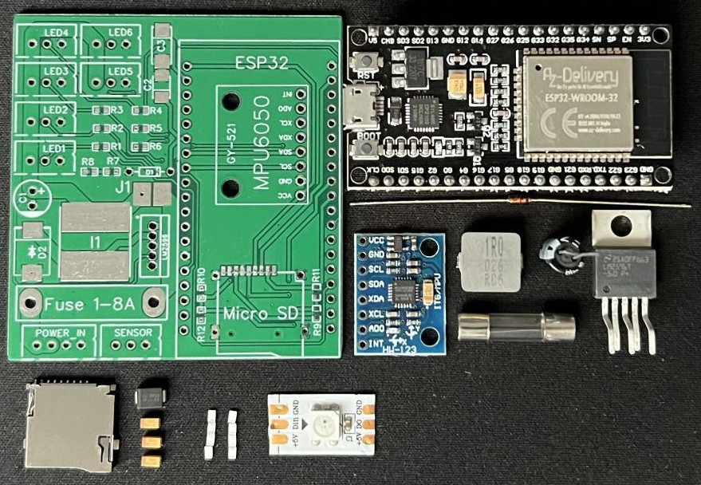
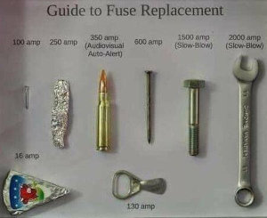
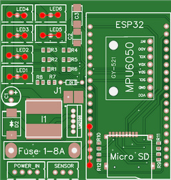
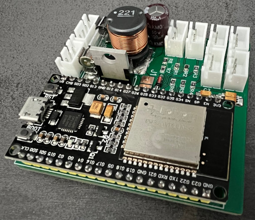

# Build Guide

Before starting with this guide, make sure to read the [planning](planning.md) document and [part list](part-list.md) first.
They contain important information and considderations before starting the project.
If you start to build the project blindly, you might run into issues later.

## General Knowledge about the Hardware

Todo

- insert pcb with pinout

## Clone or Download the Project Files

Before we start, you should clone or download the project files.
Go to the [main page](https://github.com/TheRealKasumi/TesLight) and click the `Code` button.
You can then decide if you want to clone the repository using [Git](https://git-scm.com/) or [download](https://github.com/TheRealKasumi/TesLight/archive/refs/heads/main.zip) it as zip file.


### Using Git

- Open a terminal in your destination folder
- Run `git clone https://github.com/TheRealKasumi/TesLight.git`
- A folder `TesLight` should be created, containing all project files

### Download as Zip

- Click the [download link](https://github.com/TheRealKasumi/TesLight/archive/refs/heads/main.zip)
- Extract the TesLight folder

## Order the PCB and 3D Printed Parts

Like already mentioned in the [part list](part-list.md), the PCB and 3D printed parts can be ordered at [JLCPCB](https://jlcpcb.com/).
But of course you are free to order the parts somewhere else or create them by yourself.

Open their website and click on [Order Now](https://cart.jlcpcb.com/quote) on the right, top of the page.
This should bring you to the configuration page wher you can upload the files and configure the PCB.

### Upload Gerber Files

At first the so called `gerber files` should be uploaded.
These contain all the data required to producte the PCB.
They can be found in the [/pcb/gerber](/pcb/gerber/) folder of the project.
JLCPCB requires you to upload all of them as a zip file.
Create a new zip file and put all files from the gerber folder into the root of the zip file.
Click on `Add gerber file` on the configuration page and then upload the newly created zip file.
Once the upload and processing is done, you will see a preview of the PCB. It should look like this:


### Configuration

Generally you should be fine with their default configuration.
But you are free to modify it if you wish.
However keep in mind that this can have a big impact on the price.
Changing the number of layers and dimmensions is not recommended and can lead to problems later.
Also the PCB shouldn't be too thin.
Here the default 1.6mm are just perfect.
When you are done, add the PCB to the shopping cart.


### Upload 3D Files

This works very similar to the steps described above.
Go back to the [order page](https://cart.jlcpcb.com/quote) and select `3D-Printing` at the top of the page.
The 3D files can be found in the [/models](/models/) folder of the project.
You will need one print of the [mcu_case_all.stl](/models/mcu_case_all.stl) which is the case for the TesLight controller.
Also depending on the number of light injectors for the fibre tubes, you will need the [led-case.stl](/models/led-case.stl).
The material choice is fully up to you.
But it shouldn't be metal so that it is **NOT** electrically conductive.
When you are done, add the 3D prints to the shopping cart.

### Order

Go to your shopping cart and make sure it contains all the items.
Then continue their instructions to finish the order.

## Assemble the TesLight Controller

First make sure you got the correct and all required parts.
Go back to the [part list](part-list.md) if you want to check it again.
Prepare your tools, pre-heat the soldering station and the fun part can start😋.



Don't worry, it's not as hard as it looks first.

### Voltage Regulator

Building the voltage regulator is optinal and only suitable for a current of max. 3A.
For higher currents you need to use an external 5V regulator with a higher power limit.
See [planning](planning.md#power-consumption) for more details or if you are unsure.

If you want to use an external regulator, please bridge the jumper `J1` with a bit of solder.
You can then skip to the last point.

When using the integrated regulator, this should be the first step.
This allows you to test it properly afterwards without destroying other components when you make a mistake.

**Never bridge the jumper `J1` when using the internal regulator!**

1. As a first step its's recommended to put the inductor `I1` in place and solder it to the PCB.
For this put a thin layer of solder on the pads and the legs of the inductor.
Position the inductor and heat up the solder pads.
Feed it with some more solder and press down the inductor until it soldered together.
Repeat the same for the pad on the other side.

2. Place the diode on the spot marked with `D2`.
Proceed in the same way as above.
Since it's a diode, the polarity matters.
Make sure to put it in the right direction.
You should be able to see a white line on the diode.
It must be aligned with the white line on the PCB.

3. Continue by inserting the capacitor into `C1`.
Here it's importatnt to check the polarity as well.
Otherwise the capacitor might explode.
You definitely don't want this to happen to prodect your eyes and ears.
If it's inserted correctly, cut it's legs as short as possible on the backside.
Use some solder to connect it properly.

4. Next is the `LM2596`, right next the inductor.
Obviously polarity matters again.
Make sure to have the metal part pointing to the right/ESP32/SD/MPU6050.
It's allso marked on the PCB.
Push all 5 legs through the holes and cut them as short as possible on the backside.
Solder them all in place.
Make sure to have good connections and not bridge the contacts.
They are close to each other, so pay attention.

5. As a last step it's time to solder the fuse to the PCB.
Ideally using a fuse holder.
It's for your own safety and to avoid a fire in case of issues and faults.
So I don't want you do to anything stupid like this: <br> <br>
You have been warned.
For the internal regulator please use a fuse with a maximum current of 2A.
When using external regulators make sure to pick a suitable one.
If your regulator doesn't come with a fuse on the 12V side, you should definitely add one.
The PCB should be good for around 8-10A.
However make sure that your connectors are high quality and can deal with the current.
If even higher currents are required, please bypass the PCB and connect the LED's directly to your regulator.
However dont forget to provide 5V to the TesLight controller and have a shared ground connection.

#### Test the Voltage Regulator

This step is optional but highly recommended.
When you finished building the regulator, please take some time to test it.
If there is a malfunction it could demage all your parts.
So it's definitely worth the time.

To test the regulator power the PCB with a voltage above 6-7V.
The polarity and right connections were already show at the beginning of the guide.
You should then be able to measure a voltage of 5V at the marked connections:



Increase the Voltage up to 20-30V.
The output voltage should stay stable at 5V.
If you have the option to add a load to the 5V side, please test it out.
1A of load is a good test.
The voltage should stay at stable 5V.
If that is the case, the build was successful.

### MPU6050 (Motion Sensor)

This part is the easiest and can be done in two ways.
Place the MPU6050 (Motion Sensor) in the marked place on the PCB.
Make sure to align it precisely so that the holes and contacts line up.
Now it has to be soldered to the PCB.
This can be done directly using the holes or by using small wires.
Choice is yours.
Just make sure the sensor can not move and is mounted as low and flat as possible.
The space is requied later.

### Micro SD Card Holder

At first make sure that you bought a fitting card holder by placing it on the PCB and trying to align the contacts.
Some card holder have tiny plastic pin at the bottom.
These can simply be cut so it lays flat on the PBC.
If everything seems to fit well, move the card holder aside.
Use your soldering station to put a **very thin** layer of solder onto the contact plates.
This will make the soldering process easier.
Don't forget the 4 ground contacts around the card holder.

Bring the card holder back in place and make sure it's aligned precisely.
Then start with the 4 ground contacts so that it can't move anymore.
Now continue with the remaining contacs.
It's recommended to heat then up and then do a stroking movement away from the card holder.
This way you usually get nice and clean connections.
Make sure there aren't any bridged or unconnected pins left.
This step is very important because otherwise the controller might not work later and you have to desolder the ESP32 board again.
Save yourself some pain and make sure everything is fine.

### SMD Resistors

Soldering the SMD resistors is the trickiest part.
It requires a bit of patience and focus.
A total of 8 resistors have to be soldered.
Also there are 4 optional ones which are not required unless you run into trouble.
Start with the resistors R1 to R6.
These should have a value between 220Ω and 330Ω.
Put a very thin layer of solder onto the pads.
Then allign one resistor with the pads using a tweezer.
Push it down, so that it will not slip away.
Heat up one end and press it down to the pad.
Once it got hot enough, it should stick to the pad now.
Continue the same way on the other side.
Repeat until all resistors are placed.

Then move on with the two missing resistors R7 and R8.
These should have a value of 4.7kΩ for R7 and 1kΩ for R8.
Proceed as previously.

### Zener Diode

Insert the zener diode in place and cut the legs as short as possible on the backside.
Pay attention to the polarity.
Like for the other diodes, there should be one side marked with a line.
This line has to be alligned with the PCB.
Solder it in place and you are done.

### Connectors

Same procedure once more.
Put all connectors in place and cut the legs on the backside.
Make sure to put them in the right way, it's marked on the PCB.
Solder them in place.

### ESP32

There is nothing special about installing the ESP32 on the board.
Make sure to push all pins through the holes, move it as far down as possible and cut the legs on the backside.
Solder them to the PCB and you are done.

> Maybe you want to wait with this step and test of everything works first.
> Just push all pins in the holes and let the ESP start up when you uploaded the software.
> Desoldering the ESP32 board is no fun.
> So it might be worth a test first.
> It might be that you have bad contacts this way.
> So it's recommended to push the board a little bit against the PCB to ensure good contact.

When you are done, the TesLight controller should look similar to this (some components might look a little different):


## Assemble the LEDs

todo

## Upload the Software

### TesLight Controller 

Uploading the software is the final step before you can finally test your work.
Please install the following software and extension for the upload procedure:

- [VS Code](https://code.visualstudio.com/download)
- [PlatformIO](https://platformio.org/install/ide?install=vscode)

Start VS Code and then open the [mcu](/mcu/) folder of the project.
You can do so by clicking `File` -> `Open Folder...`.
On the left all files inside the opened folder should be listed.
Open the the file `platformio.ini`.
In the configuration you can see two attributes, `upload_port` and `monitor_port`.


Connect the ESP32 of the TesLight controller to your computer via a micro USB cable.
Now you need to find out which port the controller was assigned to.
The recommendation is to use the device manager when you are using Windows.
Press the Windows key + R and type `devmgmt.msc`.
Then hit enter.
The device manager will start up and you should be able to identify the port of the controller.
Go back to the `platformio.ini` and adjust the port.
Save the file and then click the upload button at the left, bottom.


The code should now be compiled and uploaded to the board.
In case the upload fails, hold down the `Boot` button on the ESP32 until the upload started.

Now open the serial monitor by clicking the "plug" button, near to the upload button.


You should see the TesLight controller starting up but then stopping with `Failed to initialize SD card`.

```
████████╗███████╗███████╗██╗     ██╗ ██████╗ ██╗  ██╗████████╗
╚══██╔══╝██╔════╝██╔════╝██║     ██║██╔════╝ ██║  ██║╚══██╔══╝
   ██║   █████╗  ███████╗██║     ██║██║  ███╗███████║   ██║
   ██║   ██╔══╝  ╚════██║██║     ██║██║   ██║██╔══██║   ██║   
   ██║   ███████╗███████║███████╗██║╚██████╔╝██║  ██║   ██║   
   ╚═╝   ╚══════╝╚══════╝╚══════╝╚═╝ ╚═════╝ ╚═╝  ╚═╝   ╚═╝   
Firmware version 0.0.1 (beta)

00:00:00:049 [INFO] (main.cpp:setup): Initialize SD card...   
[E][sd_diskio.cpp:194] sdCommand(): Card Failed! cmd: 0x00
[E][sd_diskio.cpp:775] sdcard_mount(): f_mount failed: (3) The physical drive cannot work
[E][sd_diskio.cpp:194] sdCommand(): Card Failed! cmd: 0x00
00:00:00:659 [ERROR] (main.cpp:setup): Failed to initialize SD card.
```

### Prepare and insert the Micro SD Card

TesLight **requires** a `FAT` or `FAT32` formatted micro SD card.
At least 512MB of storage is recommended for upcoming features.
The SD card is used to store your settings, animations, logs and the browser based UI.
In the future it might be possible to create fully customized animations.
These will also be stored on the SD card.

Since the controller will create the settings and log data automatically, only the UI files must be copied to the SD card.
The UI come as single html file with all required data embedded into it.
It can be found in the [web-app](/web-app/) folder and is called [index.html.min.html](/web-app/index.html.min.html).
Create a new folder called `web-app` in the root of your SD card.
Copy the [index.html.min.html](/web-app/index.html.min.html) into the newly created folder and rename it to `index.html`.
Eject the SD card from your computer and insert it into the micros SD card slot of the TesLight controller.

## Let's test it!

Now that everything is read, it's time for a short test.
Connect the board back to your computer and fire up the serial monitor.
If everything works, you should see the following (or similar) output:

```
████████╗███████╗███████╗██╗     ██╗ ██████╗ ██╗  ██╗████████╗
╚══██╔══╝██╔════╝██╔════╝██║     ██║██╔════╝ ██║  ██║╚══██╔══╝
   ██║   █████╗  ███████╗██║     ██║██║  ███╗███████║   ██║
   ██║   ██╔══╝  ╚════██║██║     ██║██║   ██║██╔══██║   ██║   
   ██║   ███████╗███████║███████╗██║╚██████╔╝██║  ██║   ██║   
   ╚═╝   ╚══════╝╚══════╝╚══════╝╚═╝ ╚═════╝ ╚═╝  ╚═╝   ╚═╝
Firmware version 0.0.1 (beta)

00:00:00:049 [INFO] (main.cpp:setup): Initialize SD card...
00:00:00:060 [INFO] (main.cpp:setup): SD card initialized.
00:00:00:061 [INFO] (main.cpp:setup): Switching to SD card logger...
␀00:00:00:570 [INFO] (main.cpp:setup): Switched to SD card logger.
00:00:00:592 [INFO] (main.cpp:setup): Initialize, load and save configuration...
00:00:00:616 [INFO] (Configuration.cpp:load): Loading configuration from file "/config.tli"...
00:00:00:645 [INFO] (Configuration.cpp:save): Saving configuration to file "/config.tli"...
00:00:00:742 [INFO] (Configuration.cpp:save): Configuration saved.
00:00:00:765 [INFO] (main.cpp:setup): Runtime configuration loaded.
00:00:00:785 [INFO] (main.cpp:setup): Initialize LED drivers and animator...
00:00:00:807 [INFO] (LedDriver.cpp:begin): Initialize LED driver for 70 LEDs using pin 13 and rmt channel 0.
00:00:00:828 [INFO] (LedDriver.cpp:begin): LED driver initialized successfully.
00:00:00:850 [INFO] (LedDriver.cpp:begin): Initialize LED driver for 4 LEDs using pin 14 and rmt channel 1.
00:00:00:882 [INFO] (LedDriver.cpp:begin): LED driver initialized successfully.
00:00:00:909 [INFO] (LedDriver.cpp:begin): Initialize LED driver for 2 LEDs using pin 15 and rmt channel 2.
00:00:00:934 [INFO] (LedDriver.cpp:begin): LED driver initialized successfully.
00:00:00:961 [INFO] (LedDriver.cpp:begin): Initialize LED driver for 4 LEDs using pin 16 and rmt channel 3.
00:00:00:987 [INFO] (LedDriver.cpp:begin): LED driver initialized successfully.
00:00:01:014 [INFO] (LedDriver.cpp:begin): Initialize LED driver for 4 LEDs using pin 17 and rmt channel 4.
00:00:01:064 [INFO] (LedDriver.cpp:begin): LED driver initialized successfully.
00:00:01:088 [INFO] (LedDriver.cpp:begin): Initialize LED driver for 4 LEDs using pin 21 and rmt channel 5.
00:00:01:108 [INFO] (LedDriver.cpp:begin): LED driver initialized successfully.
00:00:01:129 [INFO] (main.cpp:setup): LED drivers and animators initialized.
00:00:01:149 [INFO] (main.cpp:setup): Initialize light sensor...
00:00:01:169 [INFO] (main.cpp:setup): Light sensor initialized.
00:00:01:195 [INFO] (main.cpp:setup): Initialize motion sensor...
00:00:01:215 [INFO] (MotionSensor.cpp:MotionSensor): Initializing Motion Sensor properties.
00:00:01:235 [INFO] (MotionSensor.cpp:begin): Initializing Initializing Motion Sensor.
00:00:01:258 [INFO] (MotionSensor.cpp:begin): Initially filling buffer.
00:00:01:288 [INFO] (MotionSensor.cpp:begin): Calculating sensor offsets.
00:00:01:308 [INFO] (MotionSensor.cpp:begin): Motion sensor initialized successfully.
00:00:01:334 [INFO] (main.cpp:setup): Motion sensor initialized.
00:00:01:353 [INFO] (main.cpp:setup): Initialize WiFiManager...
00:00:01:373 [INFO] (WebServer.cpp:WebServer): Initializing WiFi manager.
00:00:01:516 [INFO] (WebServer.cpp:WebServer): WiFi manager initialized.
00:00:01:539 [INFO] (main.cpp:setup): WiFi manager initialized.
00:00:01:559 [INFO] (main.cpp:setup): Creating to WiFi network...
00:00:01:580 [INFO] (WebServer.cpp:startAccessPoint): Starting WiFi access point with ssid 'TesLight' and password 'TesLight' on channel 1.
00:00:01:608 [INFO] (WebServer.cpp:startAccessPoint): WiFi access point started. Listening on: 192.168.4.1
00:00:01:629 [INFO] (main.cpp:setup): WiFi Network created.
00:00:01:649 [INFO] (main.cpp:setup): Starting Webserver...
00:00:01:669 [INFO] (WebServer.cpp:WebServer): Starting webserver on port 80.
00:00:01:691 [INFO] (WebServer.cpp:WebServer): Webserver running.
00:00:01:712 [INFO] (main.cpp:setup): Webserver started on port 80.
00:00:01:732 [INFO] (main.cpp:setup): Initializing REST api...
00:00:01:761 [INFO] (main.cpp:setup): REST api initialized.
00:00:01:781 [INFO] (main.cpp:setup): TesLight initialized successfully, going into work mode.
00:00:10:000 [INFO] (main.cpp:loop): LEDs running at an average of 60 FPS
```

When this is the case, you successfully built the TesLight controller.
Now search for a WiFi network called `TesLight`.
Connect to it using the default password `TesLight` and open up `192.168.4.1` in your browser.
Now the TesLight UI should show up.
Bookmark this page so that you will not forget about it.
For here you can controll your LED's.
But don't forget to connect to the `TesLight` WiFi first.
The password can be changed in the settings.
