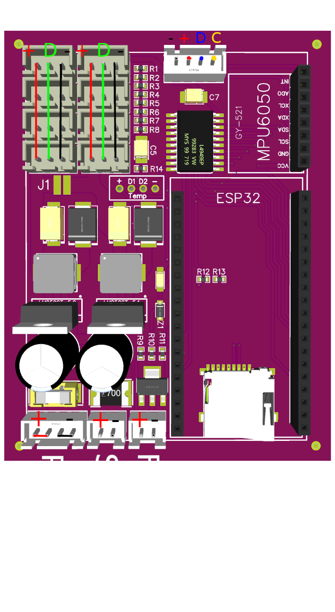

# Build Guide

Before starting with this guide, make sure to read the [General Knowledge Collection](./knowledge.md) and [Part List](part-list.md) first.
They contain important information and some considerations before beginning the project.
If you start to build the project blindly, you might run into a lot of issues and questions later.


## Clone or Download the Project Files

At first you should clone or download the project files.
Go to the [project's main page](https://github.com/TheRealKasumi/NikoLight) and click the `Code` button.
You can then decide if you want to clone the repository using [Git](https://git-scm.com/) or [download](https://github.com/TheRealKasumi/NikoLight/archive/refs/heads/main.zip) it as zip file.


As an alternative you can also go to the releases and download one of them.

### Using Git

- Open a terminal in your destination folder
- Run `git clone https://github.com/TheRealKasumi/NikoLight.git`
- A folder `NikoLight` will be created, containing all project files

### Download as Zip

- Click the [download link](https://github.com/TheRealKasumi/NikoLight/archive/refs/heads/main.zip)
- Extract the NikoLight folder

## Order the PCB and 3D Printed Parts

Like already mentioned in the [part list](part-list.md), the PCB and 3D printed parts can be ordered at [JLCPCB](https://jlcpcb.com/).
But of course you are free to order the parts somewhere else or create them by yourself.

Open their website and click on [Order Now](https://cart.jlcpcb.com/quote) on the right, top of the page.
This should bring you to the configuration page where you can upload the files and configure the PCB.

### Upload Gerber Files

First, the so-called `gerber files` should be uploaded.
These contain all the data required to produce the PCB.
They can be found in the [/pcb/gerber](/pcb/gerber/) folder of the project.

Now two different versions are available.
One version of the board comes with pre-installed DIP headers so that no soldering is required for the board.
The other version has no such header to save space.
Therefore soldering the ESP32 and MPU6050 to the board is required.
Choice is yours

JLCPCB requires you to upload one the zip archives with the gerber files first.
Click on `Add gerber file` on the configuration page and then upload the zip archive of your choice.
Once upload and processing is done, you will see a preview of the PCB.
It should look like this, with the two left images:


### Board Configuration

Generally, you should be fine with their default configuration but you are free to modify it if you wish.
However, keep in mind that this can have a big effect on the price.
Changing the number of layers and dimensions is not recommended and can lead to problems later.
Also the PCB shouldn't be too thin.
Here the default 1.6mm is just perfect.
For a nice look I would recommend black or purple PCBs, even if the build time is a little higher usually.


### Assembly Service

When you are done, configuring the PCB, then it's time to configure the assembly service.
At first you need to chose one of their assembly services.
`Economic` and `Standard` are the available options.

Economic:

- Cheaper
- Collection of boards of different customers are created together
- No borders required
- Takes longer

Standard:

- More expensive
- Your boards are checked, adjusted and produced individually
- Borders and markers are required
- Faster production

Once more, choice is yours but `Economic` is recommended.
Assembly side must always be `top`.
Tooling holes should be added by JLCPCB and confirmation of parts placement is recommended.


Once you are done, click on `Confirm`.

### Upload BOM and Placement Files

On the next page you need to upload the BOM (material list) file.
This file contains all components that should be placed on the board.
At the same time you need to upload a so called "pick and place" file.
It is used for the correct component placement.
Make sure to upload the correct files, matching your board version.
Click next to move to the following step.

### Select the parts that should be placed

On this page you should check if all parts are available.
Also you can select whcih components should be installed.
If you want to install a few components on you own, you can unselect them here.
Once done click next and add the items to your shopping cart.

### Upload or Print 3D Files

Ordering works very similar to the steps described above.
Go back to the [order page](https://cart.jlcpcb.com/quote) and select `3D-Printing` at the top of the page.
The 3D files can be found in the [/model](/model/) folder of the project.

In a normal build you will need both, the [NikoLight_Case.stl](/model/NikoLight_Case.stl) and the [NikoLight_Case_Cover.stl](/model/NikoLight_Case_Cover.stl).
The all-in-one verion [NikoLight_Case_AIO.stl](/model/NikoLight_Case_AIO.stl) can be used as an alternative.
When you are using a smaller 30x30x6mm fan, the [NikoLight_Fan_Adapter.stl](/model/NikoLight_Fan_Adapter.stl) is recommended.
If you plan to use fiber cables and LED injectors, the [NikoLight_LED_Case.stl](NikoLight_LED_Case.stl) should be ordered as well.
The number depends on the number of light injectors you want to use for the fibre tubes.

Generally the material choice shouldn't be a metal.
The cases must **NOT** be electrically conductive but it is otherwise up to you.
A recommendation is to use a more heat resistant material like ABS or PETG.
Ideally a flame-retardant material is used.

When you plan to print the case yourself, the following setup is recommended:

- Nozzle: 0.4 - 0.6mm
- Layerheight 0.1 - 0.2mm

### Order

Open your shopping cart and make sure it contains all required items.
Then complete the order.

## Assemble the NikoLight Controller

### Fully Assembled Boards

Your boards will be produced and assembled by the PCB serivce.
Insert the MPU6050 and ESP32 boards into their place and you are done.
The ESP32 USB port should point to the bottom.
Pay attention to not install it the wrong way around.
The MPU6050 is installed so that the PCB points to the left when the ESP32 USB port is pointing towards you.
That's it, you went for the simple way and you are done😋.

### Manual Assembly

First, make sure you have all required parts.
Go back to the [part list](part-list.md) if you want to check it again.
Prepare your tools, pre-heat the soldering station and then the "fun part" can start😋.

#### Soldering of small Components

I would recommend to start with the small components first.
For the small components I created a short video to show how it can be done.
Especially when you are new to SMD components, it is recommended to watch the video first and follow the steps shown.
Some steps might be missing or are different depending on your board version.
But since you are a tinkerer, I am sure you can do it.

[](https://www.youtube.com/watch?v=Nh1XLG8EGs4)

#### Soldering the remaining Components

Generally the remaining components are soldered with the "through-hole technique".
For this cut the legs of the components so that they are just long enough to reach the other side of the PCB.
Insert the component and flip the PCB around.
Always pay attention to the polarity of the components.
Capacitors can potentially explode and hurt your ears and eyes when you insert the in the wrong way around.
Please be careful about that.

Heat up the contects and feed some solder to it until the component is soldered to the board nicely.
It's the same process for all remaining components.
Which exact component to use is printed on the backside of the PCB.

Before you install the ESP32 and MPU6050, you can relatively safely test the voltage regulators.

##### Test the Voltage Regulator

This step is optional but highly recommended.
When you finished building the regulator, please take some time to test it.
If there is a malfunction, it could damage all your other parts.
So it's definitely worth the time.

To test the regulator power the PCB with a voltage above 7V.
It would be good practice to use a low current limit like 250mA.
The polarity and right connections were already shown at the beginning of the guide.
You should then be able to measure a voltage of 5V at the LED outputs.



Increase the Voltage up to 18V if possible.
The output voltage should stay stable at 5V and the input current should stay very low (usually less than 10mA).
If you have the option to add a load to the 5V side, please test it out.
1A of load is a good test.
If the voltage doesn't break down under load, the build of the regulators was successful.
Once you are done, you can solder all remaining parts to the PCB.

#### ESP32

There is nothing special about installing the ESP32 on the board.
Make sure to push all pins through the holes, move it as far down as possible and cut the legs on the backside.
Solder them to the PCB and you are done.

> Maybe you want to wait with this step and test if everything works first.
> Just push all pins in the holes and let the ESP start up when you uploaded the software.
> Desoldering the ESP32 board is no fun.
> So it might be worth a test first.
> You may find you have bad contacts.
> So it's recommended to push the board a little bit against the PCB to ensure good contact.

When you are done, the NikoLight controller should look similar to this (some components might look a little different):


## Install position in car

It would be best if the antenna of the ESP32 points to the front and the USB port to the back of the vehicle. This way we ensure consistent acceleration directions from the sensor for all users.

## Assemble the LED Injectors (optional for fiber cables)

First of all you should make sure to have the correct number of cases and LEDs.
Also it's recommended that you have an good idea of where you want to place the LEDs, how many and what the wire lengths are.
It will save a lot of trouble to do good planning prior.

Building the "light injectors" is pretty straightforward.
All you need to do is to connect the LEDs with the wires, pay attention to the wire lengths and then push them into their case.
The LEDs are connected like shown in the following picture.
Pay attention to the polarity and everything will work out fine.


If you are done building the chains and inserting the LEDs into their case, it's recommended to apply some glue so they can't slip out again.
Fabric tape can also be used to fix them in place.
Also, you can use it to wrap the wires and avoid unwanted noises when driving.
Last step is to solder or crimp the XH 3 pin male connector to the first LED.
The following picture shows the pinout.


When one "injector chain" is done, it should look something like this.


As you can see it's also possible to solder a female connector to the first LED and then use an extension cable.
This allows to easily replace the LEDs in case one dies at some point in the future.
But this is entirely optional.


## Attach Wires to LED Strips (optional for LED Strips)

This is very much the same procedure as for the LED injectors.
Usually to connections for WS2812 LED strips is as follows.


Make sure to correctly install the cables and connectors.
Once again, this is how the connections should look at the end.


## Attach Wires to Light Bars (optional for Light Bars)

Since the light bars also only use an LED strip internally, the procedure is the same as for the LED strips above.
However, depending on the light bars, the polarity might be different.
It is highly recommended, to open the light bar at the cable end to check on the polarity.
We already encountered the same type of light bars with different cable colors for the connections.
So please be careful and don't trust the cable colours.
How to check: The middle cable (green?) should always be data. Then plug one cable to GND and connect the other one with a 220 Ohm resistor to 5 V. If the strip turns on, then everything is good. If not, try the other way around. There should be no current flowing through the resistor high enough to damage the strip.

At the end the 3 pin XH connectors must have the following pinout.


## Upload the Software

### NikoLight Controller

Uploading the software is the final step before you can test your work.
Please install the following software and extension for the upload procedure:

- [Git](https://git-scm.com/downloads)
- [VS Code](https://code.visualstudio.com/download)
- [PlatformIO](https://platformio.org/install/ide?install=vscode)
- [NodeJS](https://nodejs.org)
- [NPM (comes with NodeJS)](https://www.npmjs.com/)

Start VS Code and then open the [mcu](/mcu/) folder of the project.
You can do so by clicking `File` -> `Open Folder...`.
On the left all files inside the opened folder should be listed.
Open the file `platformio.ini`.
In the configuration you can see two attributes, `upload_port` and `monitor_port`.


Connect the NikoLight controller to your computer via a micro USB cable.
Now you need to find out which port the controller was assigned to.
The recommendation is to use the device manager when you are using Windows.
Press the Windows key + R and type `devmgmt.msc`.
Then hit enter.
The device manager will start up and you should be able to identify the port of the controller.
Go back to the `platformio.ini` and adjust the port.
For Linux and Unix users I will not even explain this step.
They should know how this works, right😛?
Once changed, you can save the file and close it.

Now there is one more configuration step before you are ready to upload the code to the board.
Please navigate to [include/configuration](/mcu/include/configuration) and open the file [SystemConfiguration.h](/mcu/include/configuration/SystemConfiguration.h).

If you decided to only install one voltage regulator, please do the following changes:

- `#define REGULATOR_COUNT 1`
- `#define REGULATOR_ZONE_MAPPING {{13, 0}, {14, 0}, {15, 0}, {16, 0}, {17,0}, {21, 0}, {22, 0}, {25, 0}}`

Also depending on the board version, the following changes are required.

Board version 1.0 (@luap):

- `#define REGULATOR_COUNT 1`
- `#define REGULATOR_ZONE_MAPPING {{13, 0}, {14, 0}, {15, 0}, {16, 0}, {17,0}, {21, 0}, {22, 0}, {25, 0}}`

Board version 2.0 (@PhilippDen):

- `#define LED_DEFAULT_OUTPUT_PINS {13, 17, 14, 21, 15, 22, 16, 25}`
- `#define REGULATOR_ZONE_MAPPING {{13, 0}, {17, 1}, {14, 0}, {21, 1}, {15, 0}, {22, 1}, {16, 0}, {25, 1}}`

Save the files and then click the upload button in the bottom left.


The code should now be compiled and uploaded to the board.
In case the upload fails, hold down the `boot` button on the ESP32 until the upload started.

Now open the serial monitor by clicking the "plug" button, near to the upload button.


You should see the NikoLight controller starting up, but then stops with `Failed to initialize SD card`.

```shell
NikoLight Firmware version 1.0.0

00:00:00:059 [INFO] (src/main.cpp) (setup) (331): Initialize SD card.
[   364][E][sd_diskio.cpp:199] sdCommand(): Card Failed! cmd: 0x00
[   364][E][sd_diskio.cpp:802] sdcard_mount(): f_mount failed: (3) The physical drive cannot work
[   666][E][sd_diskio.cpp:199] sdCommand(): Card Failed! cmd: 0x00
00:00:00:666 [ERROR] (src/main.cpp) (setup) (338): Failed to initialize SD card.
```

### Prepare and insert the Micro SD Card

NikoLight **requires** a `FAT` or `FAT32` formatted micro SD card.
At least 128MB of storage is recommended for upcoming features.
Well... we live in year 2022.
So just throw a 4GB+ card inside and be done.
The SD card is used to store your settings, animations, logs and the browser based UI.
Also, it can be used to save and play `fseq` files, with fully customized animations.

Since the controller will create the settings and log data automatically, only the UI files must be copied to the SD card.
These can be found in the [ui](/ui/) folder.
But not so fast, there is a mandatory build step first.
Open a terminal of your choice and navigate to the mentioned folder.
Once you are there, please run the following commands.

```sh
npm install
npm run build
```

This can take a moment and should create a [dist](/ui/dist/) folder.
Create a new folder called `ui` in the root of your SD card.
Copy the content of [dist](/ui/dist/) into the newly created folder.
Eject the SD card from your computer and insert it into the micro SD card slot of the NikoLight controller.

## Let's test it

Now that everything is ready, it's time for a short test.
Connect the board back to your computer and fire up the serial monitor.
If required, press the reset button on the ESP32 board.
If everything works, you should see the following (or similar) output:

```shell
Nikolight Firmware version 1.0.0

00:00:00:059 [INFO] (src/main.cpp) (setup) (331): Initialize SD card.
00:00:00:071 [INFO] (src/main.cpp) (setup) (334): SD card initialized.
00:00:00:072 [INFO] (src/main.cpp) (setup) (342): Switching to SD card logger.
00:00:00:593 [INFO] (src/main.cpp) (setup) (346): Switched to SD card logger.
00:00:00:645 [INFO] (src/main.cpp) (setup) (354): Check if system update is available.
[   674][E][vfs_api.cpp:104] open(): /sd/update/update.tup does not exist, no permits for creation
00:00:00:675 [INFO] (src/main.cpp) (setup) (362): No available system update found.
00:00:00:832 [INFO] (src/main.cpp) (setup) (365): Initialize, load and save configuration.
[  1045][E][vfs_api.cpp:104] open(): /sd/config.tli does not exist, no permits for creation
00:00:01:046 [ERROR] (src/util/BinaryFile.cpp) (open) (46): Failed to open binary file.
00:00:01:262 [ERROR] (src/configuration/Configuration.cpp) (load) (158): Failed to load configuration file: /config.tli
00:00:01:289 [ERROR] (src/main.cpp) (initializeConfiguration) (140): Failed to initialize runtime configuration from MicroSD card.
00:00:01:556 [WARN] (src/main.cpp) (setup) (372): Failed to load configuration. Loading defaults and continue.
00:00:01:825 [INFO] (src/main.cpp) (setup) (376): Updating log level from configuration.
00:00:02:049 [INFO] (src/main.cpp) (setup) (379): Log level updated from configuration.
00:00:02:071 [INFO] (src/main.cpp) (setup) (381): Initialize LED Manager.
00:00:02:093 [INFO] (src/main.cpp) (setup) (383): LED Manager initialized.
00:00:02:121 [INFO] (src/main.cpp) (setup) (385): Initialize light sensor.
00:00:02:145 [INFO] (src/main.cpp) (setup) (387): Light sensor initialized.
00:00:02:167 [INFO] (src/main.cpp) (setup) (389): Initialize motion sensor.
00:00:02:205 [INFO] (src/main.cpp) (setup) (392): Motion sensor initialized.
00:00:02:228 [INFO] (src/main.cpp) (setup) (399): Initialize WiFiManager.
00:00:02:250 [INFO] (src/wifi/WiFiManager.cpp) (WiFiManager) (16): Initializing WiFi manager.
00:00:02:402 [INFO] (src/wifi/WiFiManager.cpp) (WiFiManager) (18): WiFi manager initialized.
00:00:02:427 [INFO] (src/main.cpp) (setup) (401): WiFi manager initialized.
00:00:02:449 [INFO] (src/main.cpp) (setup) (403): Starting Webserver.
00:00:02:471 [INFO] (src/server/WebServerManager.cpp) (WebServerManager) (20): Starting webserver on port 80.
00:00:02:495 [INFO] (src/server/WebServerManager.cpp) (WebServerManager) (25): Webserver running.
00:00:02:521 [INFO] (src/main.cpp) (setup) (405): Webserver started on port 80.
00:00:02:549 [INFO] (src/main.cpp) (setup) (407): Initializing REST api.
00:00:02:588 [INFO] (src/main.cpp) (setup) (409): REST api initialized.
00:00:02:610 [INFO] (src/main.cpp) (setup) (411): Load LEDs and animators from configuration using the LED Manager.
00:00:02:661 [INFO] (src/main.cpp) (setup) (414): LEDs and animators loaded.
00:00:02:683 [INFO] (src/main.cpp) (setup) (421): Creating to WiFi network.
00:00:02:707 [INFO] (src/wifi/WiFiManager.cpp) (startAccessPoint) (40): Starting WiFi access point with ssid 'NikoLight' and password 'NikoLightPW' on channel 1.
00:00:02:737 [INFO] (src/wifi/WiFiManager.cpp) (startAccessPoint) (53): Starting WiFi access point.
00:00:02:859 [INFO] (src/wifi/WiFiManager.cpp) (startAccessPoint) (56): Configuring WiFi access point.
00:00:02:882 [INFO] (src/wifi/WiFiManager.cpp) (startAccessPoint) (61): WiFi access point started. Listening on: 192.168.4.1
00:00:02:905 [INFO] (src/main.cpp) (setup) (424): WiFi Network created.
00:00:02:934 [INFO] (src/main.cpp) (setup) (431): Initialize timers.
00:00:02:955 [INFO] (src/main.cpp) (initializeTimers) (243): Initialize timers.
00:00:02:977 [INFO] (src/main.cpp) (setup) (433): Timers initialized.
00:00:02:999 [INFO] (src/main.cpp) (setup) (435): NikoLight initialized successfully, going into work mode.
00:00:12:983 [INFO] (src/main.cpp) (loop) (488): LEDs running at an average of 60 FPS
```

When this is the case, you successfully built the NikoLight controller.
Success!
Now search for a WiFi network called `NikoLight`.
Connect to it using the default password `NikoLightPW` and open up `192.168.4.1` in your browser.
Now the NikoLight UI should show up.
Bookmark this page so that you will not forget it.
Alternatively, you can also try to "install" the UI on your device.
Since it is a ReactJS based UI, some devices offer support for this.

From here you can control NikoLight using the browser based UI.
But don't forget to connect to the `NikoLight` WiFi first.
The ssid and password can be changed in the settings.
I am sure you will figure out how the UI works :) .
