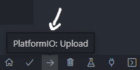

# Build Guide

Before starting with this guide, make sure to read the [planning](planning.md) document and [part list](part-list.md) first.
They contain important information and considderations before starting the project.
If you start to build the project blindly, you might run into issues later.

## General Knowledge about the Hardware

Todo

## Clone or Download the Project Files

Before we start, you should clone or download the project files.
Go to the [main page](https://github.com/TheRealKasumi/TesLight) and click the `Code` button.
You can then decide if you want to clone the repository using [Git](https://git-scm.com/) or [download](https://github.com/TheRealKasumi/TesLight/archive/refs/heads/main.zip) it as zip file.

### Using Git

- Open a terminal in your destination folder
- Run `git clone https://github.com/TheRealKasumi/TesLight.git`
- A folder `TesLight` should be created, containing all project files

### Download as Zip

- Click the [download link](https://github.com/TheRealKasumi/TesLight/archive/refs/heads/main.zip)
- Extract the TesLight folder

## Order the PCB and 3D Printed Parts

Like already mentioned in the [part list](part-list.md), the PCB and 3D printed parts can be ordered at [JLCPCB](https://jlcpcb.com/).
But of course you are free to order the parts somewhere else or create them by yourself.

Open their website and click on [Order Now](https://cart.jlcpcb.com/quote) on the right, top of the page.
This should bring you to the configuration page wher you can upload the files and configure the PCB.

### Upload Gerber Files

At first the so called `gerber files` should be uploaded.
These contain all the data required to producte the PCB.
They can be found in the [/pcb/gerber](/pcb/gerber/) folder of the project.
JLCPCB requires you to upload all of them as a zip file.
Create a new zip file and put all files from the gerber folder into the root of the zip file.
Click on `Add gerber file` on the configuration page and then upload the newly created zip file.
Once the upload and processing is done, you will see a preview of the PCB. It should look like this:

### Configuration

Generally you should be fine with their default configuration.
But you are free to modify it if you wish.
However keep in mind that this can have a big impact on the price.
Changing the number of layers and dimmensions is not recommended and can lead to problems later.
Also the PCB shouldn't be too thin.
Here the default 1.6mm are just perfect.
When you are done, add the PCB to the shopping cart.

### Upload 3D Files

This works very similar to the steps described above.
Go back to the [order page](https://cart.jlcpcb.com/quote) and select `3D-Printing` at the top of the page.
The 3D files can be found in the [/models](/models/) folder of the project.
You will need one print of the [mcu_case_all.stl](/models/mcu_case_all.stl) which is the case for the TesLight controller.
Also depending on the number of light injectors for the fibre tubes, you will need the [led-case.stl](/models/led-case.stl).
The material choice is fully up to you.
But it shouldn't be metal so that it is **NOT** electrically conductive.
When you are done, add the 3D prints to the shopping cart.

### Order

Go to your shopping cart and make sure it contains all the items.
Then continue their instructions to finish the order.

## Assemble the TesLight Controller

First make sure you have all required parts.
Go back to the [part list](part-list.md) if you want to check it again.
Prepare your tools, pre-heat the soldering station and the fun part can start😋.

Don't worry, it's not as hard as it looks first.

### Solder the MPU6050 (Motion Sensor)

This part is the easiest and can be done in two ways.
Place the MPU6050 (Motion Sensor) in the marked place on the PCB.
Make sure to align it precisely so that the holes and contacts line up.
Now it has to be soldered to the PCB.
This can be done directly using the holes or by using small wires.
Choice is yours.
Just make sure the sensor can not move and is mounted as low and flat as possible.
The space is requied later.

### Solder the Micro SD Card Holder

At first make sure that you bought a fitting card holder by placing it on the PCB and trying to align the contacts.
Some card holder have tiny plastic pin at the bottom.
These can simply be cut so it lays flat on the PBC.
If everything seems to fit well, move the card holder aside.
Use your soldering station to put a **very thin** layer of solder onto the contact plates.
This will make the soldering process easier.
Don't forget the 4 ground contacts around the card holder.

Bring the card holder back in place and make sure it's aligned precisely.
Then start with the 4 ground contacts so that it can't move anymore.
Now continue with the remaining contacs.
It's recommended to heat then up and then do a stroking movement away from the card holder.
This way you usually get nice and clean connections.
Make sure there aren't any bridged or unconnected pins left.
This step is very important because otherwise the controller might not work later and you have to desolder the ESP32 board again.
Save yourself some pain and make sure everything is fine.

### Solder the SMD Resistors

todo

## Assemble the LEDs

todo

## Upload the Software

### TesLight Controller 

Uploading the software is the final step before you can finally test your work.
Please install the following software and extension for the upload procedure:

- [VS Code](https://code.visualstudio.com/download)
- [PlatformIO](https://platformio.org/install/ide?install=vscode)

Start VS Code and then open the [mcu](/mcu/) folder of the project.
You can do so by clicking `File` -> `Open Folder...`.
On the left all files inside the opened folder should be listed.
Open the the file `platformio.ini`.
In the configuration you can see two attributes, `upload_port` and `monitor_port`.

Connect the ESP32 of the TesLight controller to your computer via a micro USB cable.
Now you need to find out which port the controller was assigned to.
The recommendation is to use the device manager when you are using Windows.
Press the Windows key + R and type `devmgmt.msc`.
Then hit enter.
The device manager will start up and you should be able to identify the port of the controller.
Go back to the `platformio.ini` and adjust the port.
Save the file and then click the upload button at the left, bottom.

The code should now be compiled and uploaded to the board.
In case the upload fails, hold down the `Boot` button on the ESP32 until the upload started.

Now open the serial monitor by clicking the "plug" button, near to the upload button.

You should see the TesLight controller starting up but then stopping with `Failed to initialize SD card`.

### Prepare and insert the Micro SD Card

TesLight **requires** a `FAT` or `FAT32` formatted micro SD card.
At least 512MB of storage is recommended for upcoming features.
The SD card is used to store your settings, animations, logs and the browser based UI.
In the future it might be possible to create fully customized animations.
These will also be stored on the SD card.

Since the controller will create the settings and log data automatically, only the UI files must be copied to the SD card.
The UI come as single html file with all required data embedded into it.
It can be found in the [web-app](/web-app/) folder and is called [index.html.min.html](/web-app/index.html.min.html).
Create a new folder called `web-app` in the root of your SD card.
Copy the [index.html.min.html](/web-app/index.html.min.html) into the newly created folder and rename it to `index.html`.
Eject the SD card from your computer and insert it into the micros SD card slot of the TesLight controller.

## Let's test it!

todo
