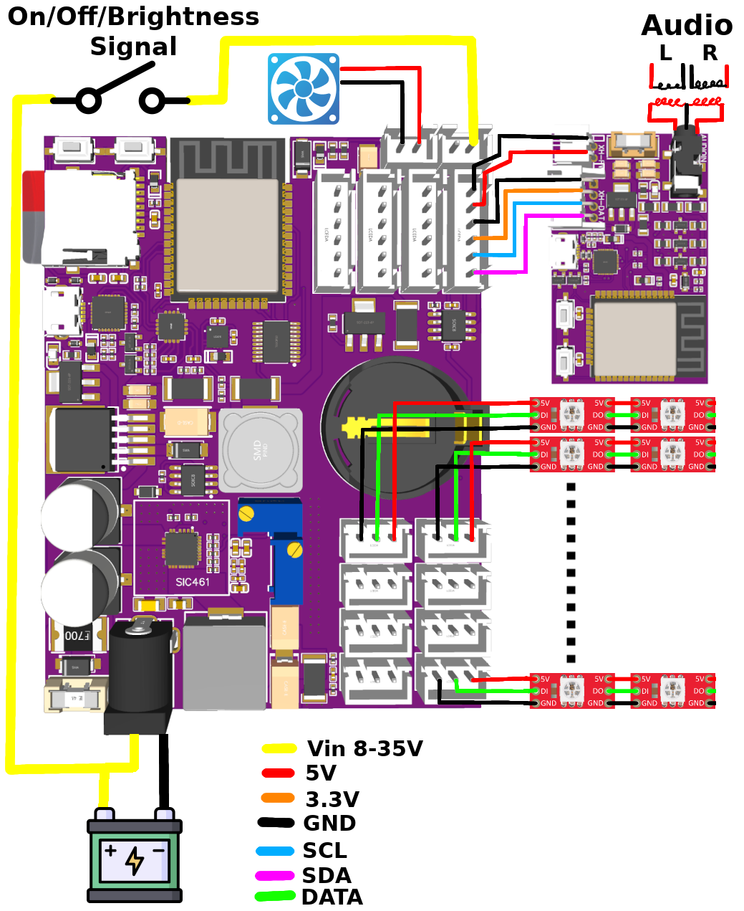
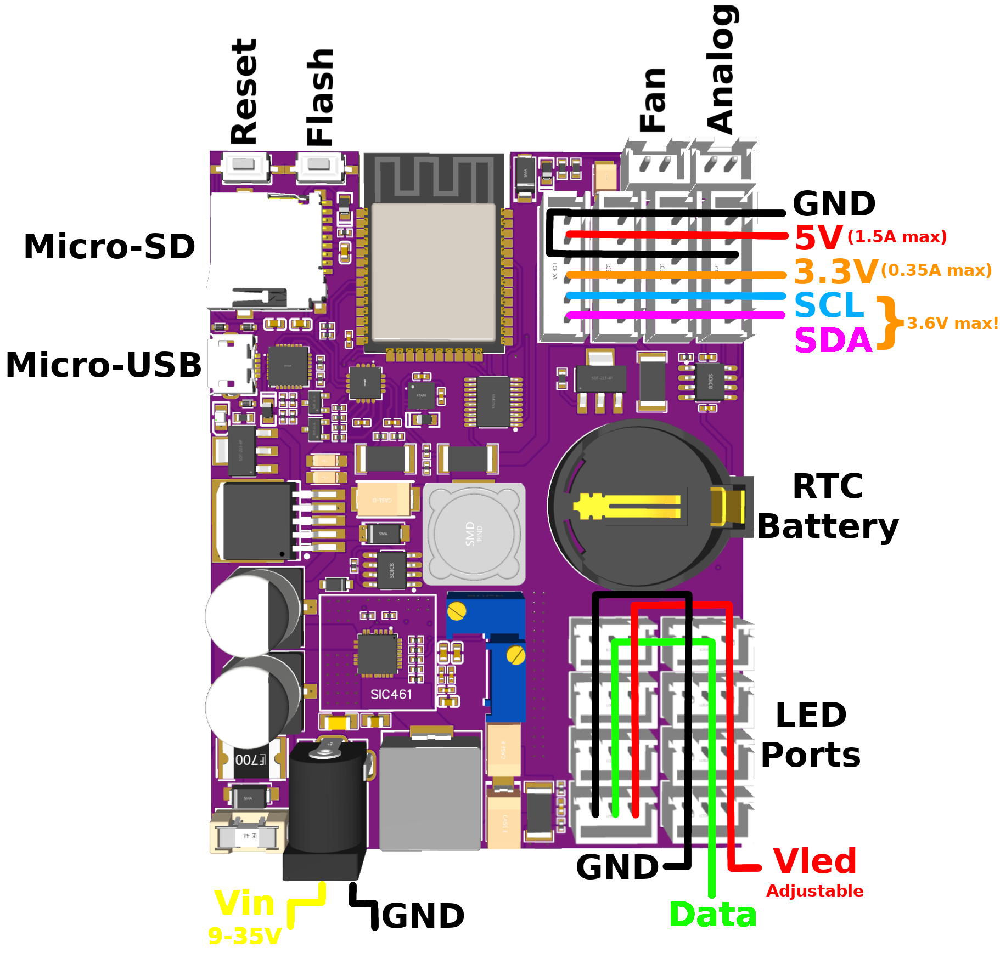

# General Knowledge Collection

This document contains general knowledge required to work with the NikoLight project.
It is recommended for everyone before the project is started.
In case further guidance and information is required, please reach out to our [Discord Server](https://discord.gg/Zq4sWKZm8n).

## NikoLight

As the [ReadMe](../ReadMe.md) states, NikoLight is an open source ambient light system.
It can be integrated in almost any vehicle and offers a variety of advanced light effects and features.
Before getting started with a project, it is important to get an overview over its components and their wiring.
The following images show a typical setup for the board versions 2.2 and 2.1.

### Board Version 2.2



The main component of this setup is the NikoLight board on the left.
It contains the MCU (Main Control Unit), which controls all other components that are connected to the board.
Also, it provides power to all components of the system.
In the first place, this board will be connected to all LED strips.
It provides power to the LEDs and also outputs the required data signal.
The board also creates a WiFi hotspot which can be used to connect to the device.
Afterwards the browser-based app can be used to configure the system.
The cooling fan on the top is always highly recommended.
It is connected directly to the NikoLight board and is conntrolled by the MCU.
The Fan must be installed on top of the NikoLight board so that it stays cool.

On the right, the optional NikoLight Audio Unit can be found.
Both boards are connected together via the 6 pin XH connector.
Purpose of the Audio Unit is to capture and digitalize an analog audio signal.
It is preprocessed and afterwards transmitted to the MCU.
There it can be used to generate audio based light effect.

The `On/Off/Brigness` connection is an analog sensor of the NikoLight board.
This sensor can be configured in the app.
Depending on the input voltage it can turn the LEDs on and off.
It can also be used to control the brightness of the LEDs or be completely ignored.

#### Pinout



#### Micro USB

The micro USB connector can be used as data port to upload a new firmware to the board or to output debug information.
Usually it is only required for the first time setup or for development purposes.
After the first setup, firmware updated can be install wireless via the app.

#### DC Power Jack

The DC power jack is used to power the whole NikoLight system.
It accepts any DC voltage of 8V up to 35V.
The positive connection is the center pin while the negative connection are the outer pins.


The NikoLight board already contains two fuses to avoid damages in case of overload and short-circuits.
One of them is resettable and triggers in case of a longer overload scenario.
This means the board can be directly connected to a battery or any switched power line of the vehicle.
However it should be able to provide at least 8A of continious current and cable sizes must be chosen accordingly.
The power input of the board is protected against reverse polarity.
A diode will avoid any significant reverse voltage by blowing the fuse and so cutting power.
Keep in mind that this will protect the board but the fuse must be replaced afterwards.

#### LED Connector - 3 Pin XH

The 3 pin XH connectors are used to connect the LEDs to the NikoLight board.
They provide a precisely adjustable and stable voltage and transmit a 5V data signal to the LEDs. 
The output voltage can be adjusted via the lower potentiometer.
It will always be lower than the input voltage since a step-down converter is used.

> :warning:
> The output voltage is adjustable but should never exceed 16V.
> This is the limit of the filter capacitors.
> Always make sure to stay below this limit.
> Otherwise permanent damage could be cause.

This new version of the NikoLight board utilizes a highly efficient and powerful synchronious step-down converter.
It provides a continous current of 10A and short peak currents (<10ms) of up to 28A, depending on the output voltage.
All of the eight LED connectors are connected in parallel to the regulator.
As a consequence, each connector can provide the full 10A but they are also limited to 10A in total.
Generally it is recommended to not use more than 3A per connector to prevent them from heating up.

Each of the LED connectors is continously monitored by the regulator and the MCU.
When over-temperature or short-circuits are detected, the power output will be cut off within milliseconds.
Further the MCU calculates the expected power consumption depending on the connected LEDs.
If a unusual high power draw is detected over a short period od time, the power will also be cut off.
The LED counts and current values can be configured in the UI.

#### Fan Connector

The fan connector is used to connect a 5V cooling fan.
It is always highly recommended to install a suitable cooling fan to keep the board cool.
The fan is controlle by the MCU via a PWM signal and the speed is adjustend depending on the board temperature.
It can output up to 300mA but it is recommended to stay below that limit.
Most 30x30x6mm fans require significantly less power.

#### Analog Input

The analog input is connected to a voltage devider, a low-pass filter and analog to digital converter.
This means the MCU can measure the voltage at the connector to control the LEDs.
Due to the low-pass filter, PWM signals with a frequency higher than 25Hz can be used as well.
The function of the input can be configured in the software to be used as on/off switch or to control the brightness of the LEDs.

> :warning:
> The input shares the same ground reference as the rest of the setup.
> The ground pin is only intended for smoother readings.
> Make sure to never connect it to anything with a different voltage potential.


#### I²C Connector - 6 Pin XH

The I²C connectors can be used to connect extension modules like the NikoLight Audio Unit or other sensors.
They all share the same I²C bus that is also used on the board.
Therefore it must be ensure that the signal is not degraded by long and bad wiring.
The signal level is 3.3V and the signals must never exceed 3.6V.
Internal 2.2k pull-up resistors are used which makes external ones optional.
Besides the I²C data lanes these conectors also provide power to external modules.
There is 3.3V and a 5V line.

The 3.3V line can provide up to 500mA continiously and 800mA peak.
It is highly recommended to stay below that limit since the MCU and other on-board electronics are powered by this line.
The 3.3V line features an over-temperature, over-current and short-circuit protection.
High current peaks and noise can lead to resets of the MCU or other hardware modules.
If more power is required, the 5V line should be used to power external modules.
However it must always be ensure to not exceed the 3.6V limit of tha data lines.

The 5V line can provide up to 1.5A continously and around 3A for up to 5 seconds.
It features an over-temperature, over-current and short-circuit protection.
The 5V line is independent of the LED power line and will always stay at a fixed 5V.
Even tho it is possible to power LEDs with this power line, it is not recommended.
The regulator is inefficient in comparison to the synchronious converter for the LEDs and will create a lot of heat.
Also it power the data signal for the LEDs.
This means that noise can corrupt the data signal and make the LEDs behave unexpectedly.

### Board Version 2.1

Todo

## Luminant Types

Currently there are three different types of luminants available that you can choose from.
They are all fully supported by NikoLight, but not each luminant is suitable for each installation location.
For best results, you should select them carefully.

### Basic WS2812B LED strip

This is the most widely availble type of luminant - a series of WS2812B LEDs mounted in series on a thin, flexible PCB strip.
These strips are available in various lenghts, widths and density (count of LEDs per meter).
Possible installation locations for the LED strip are the dashboard and the foot wells.
A density of around 60 LEDs/meter is a good compromise between cost/power consumption and good looking light (effects).

#### Advantages

- easy to obtain in various configurations
- supports all light effects since many LEDs are distributed across the strip

#### Disadvantages

- can only be installed in locations where it is not directly visible

### Fiber tube with WS2812 LEDs as light injectors

This type of luminant is a small flexible tube with a tab on it's side.
WS2812B LEDs can be placed on one or (better) both ends of the tube to inject light into the tube and make it glow (fairly) evenly along its entire length.
The fiber tube is suitable for most installation locations with the exception of the footwell lighting.

#### Advantages of fiber tube

- low cost
- low power consumption
- easy, flexible installation

#### Disadvantages of fiber tube

- you can have at most 2 colors per tube segment, one injected from each side, which greatly limits the effects that you can display with it
- because of it's white(-ish) color the fiber tube visually stands out a bit againts dark interior in daylight which can look less professional depending on your taste
- will limit the appearance of some effects

### Light bar with WS2812B LEDs

The light bar is like a hybrid of the light strip and fiber tube.
It consists of a very thin WS2812B LED strip mounted onto an also very thin and flexible light distribution bar that is additionally covered in a black, translucent tape.
The density of the currently available light bars is very high with around 130 LEDs/meter.
Possible installation locations are the dashboard, the door panels and center console.

#### Advantages of light bar

- can be installed almost anywhere in the car, where a fiber tube can be installed as well
- supports all light effects since many LEDs are distributed across the light bar
- very bright and even light emission
- not very visible in daylight when turned off because it is wrapped in black tape

#### Disadvantages of light bar

- more expensive
- not as easy to obtain because there are not many shops that carry it (especially in Europe)
- only available in lengths up to 1 meter (but can be extend by soldering 2 bars together)
- consumes a lot of power because of the high LED count and can potentially get hot
- can also not be extend beyond 2 meters before hitting the 250 LED/channel limit


Todo from here


## Considderations regarding Power Consumption

Since NikoLight can control up to 2000 LEDs (and more), the power consumption can become relevant.
Assuming "average" WS2812B LED chips, each channel can draw around 16mA at 5V and maximum brightness.
Since each LED has 3 channels (red, green, blue), a current draw of around 48 mA has to be assumed.
To calculate the total current and power draw, the following formulas can be used:

```
current = led_count x 0.048
power = current x 5.0
```

Assuming there will be 800 LEDs connected to NikoLight, the theoretical current draw could reach 800 x 0.048 = 38.4A.
At 5V this equals a power draw of 192W.
Such high currents would easily overload the voltage regulators of any NikoLight board and the wiring would become very challening.
Most likely it could even cause trouble to get that amout of power from you vehicle.
Luckily, the power draw is a lot lower in real world applications.
First of all the power draw of the LEDs will be a little bit lower in practice.
But most important the maximum brightness of all channels will most likely never be used.
 


## Example Configuration Tesla Model 3 and Model Y

Todo

Channels, Zones and LEDs

Alright, let's start with first thing first.


NikoLight currently supports **8 LED channels**.
These channels are for the individual zones in your car.
This means that there are **8 different zones** that can be controlled independently.
How you spread them in your car is completely up to you.
You also don't have to use all of them, but you can if you want to.
A usual setup would look like this:

| Channel/Zone | Used for            |
| ------------ | ------------------- |
| 1            | Dashboard           |
| 2            | Center console      |
| 3            | Left, front door    |
| 4            | Right, front door   |
| 5            | Rear, left door     |
| 6            | Rear, right door    |
| 7            | Footwell lighting 1 |
| 8            | Footwell lighting 2 |

NikoLight is using digital LEDs.
This means it can control each LED individually.
The supported LED type is **WS2812B**.
It is highly recommended to use only **WS2812B** LEDs since these have been well tested in the project.
But you are free to use any compatible LED type when you feel confident.

> :warning:
> Make sure that the used LED type is supporting the correct voltage levels, protocols and is not overloading the NikoLight board.
> Generally a voltage level of 5V is used to power the LEDs.
> The data lines also operate at 5V.
> For more information make sure to carefully read the [LED Port section](#led-port).

Each zone can have a **variable number of LEDs**.
This number can reach from **0 up to 250**.
This is a limit in the software which was chosen to achieve a stable frame rate of 60 FPS.
In special cases, this limit can be disabled to allow up to a few thousand LEDs per channel.

Every single LED in a zone is **addressable**.
This means that NikoLight can "talk" to the individual LEDs and set a 24 bit color value for each.
You can compare this to the pixels of your monitor.
This is achieved by **chaining the LEDs**, like it is done on LED strips.
Each of these chains is connected to one channel.


The recommendation is to use a normal LED strip under the dashboard for ease of installation, cost and power consumption.
As an alternative it is also possible to use a light bar for the dashboard as well, but it requires extra effort to solder two light bars together to achieved the required length.
For the 2021 and later models use of a light bar in the dashboard and upper door panels results in a nice continuous line of light from door to door.

The fiber tubes are working well for the center console or around the seats.

For the doors, the light bars turned out to be very nice looking and be less noticeable when turned off.
The choice here is fully up to you.
All parts can be found on the [part list](part-list.md).


### Zones

As explained above, NikoLight supports up to **8 different zones**.
How you select these zones is up to you, but keep in mind that you must be able to install and wire the LEDs in the different zones.


here is a recommended configuration of the zones.
This is the same configuration as shown in the following video (click to open).

[](https://www.youtube.com/watch?v=_N5h1IViB-E)

The following table assumes that the NikoLight controller is placed below the center console for easy access and wiring. (It would be best if the antenna of the ESP32 points to the front and the USB port to the back of the vehicle. This way we ensure consistent acceleration directions from the sensor for all users.)

| Zone              | LEDs | Type                      | Cable Length | Physical Channel |
| ----------------- | ---- | ------------------------- | ------------ | ---------------- |
| Dash              | 72   | LED strip                 | 100 cm        | 1                |
| Center Console    | 4    | Fiber cable and injectors | 150 cm        | 2                |
| Front Doors       | 130  | Light bar (2 in parallel) | 215 cm + 50 cm | 3, 4             |
| Rear Doors        | 92   | Light bar                 | 405 cm + 45 cm | 5, 6             |
| Footwell lighting | 4    | LED strip or single LEDs  | 100 cm        | 7, 8             |

So for this build we have a total of around 784 LEDs and need ~20 m cable with 3 wires.
Also, ~2.5 m of fibre cable is recommended for use around the centre console.
Make sure to measure the required lengths carefully for individual build.

### Recommended length of light bars

If you are using the light bars, these are the recommended length of the light bars:
| Location | length of light bars |
| ------------- | ------------- |
| Front Doors top (MY 2019) | 100 cm, and shorten about 10 cm  |
|  Rear Doors top | 75 cm, and shorten a bit  |
| Front and Rear Doors around handle | 100 cm  |
| Dashboard | 130 cm, connect 2* 75 cm in series and shorten a bit  |
| Center console MY2019 (with cover above mobile phone holder) | 2* 85 cm (100 cm, and shorten about 15 cm) |
| Center console MY2021 | Fibre Wire, tbd light bar |

Make sure to measure the required lengths carefully for individual build.


