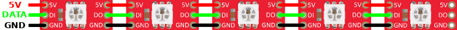
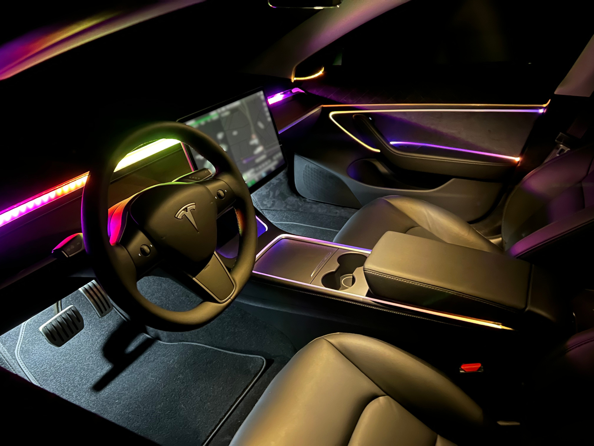

# Planning

It is recommended to read through this short document before you start with the project.
There are some important considerations and decisions you have to make first.
This will save you some trouble and makes it easier to buy the right parts.
It will also help to build the project later.

## LED Configuration

The LED configuration is the most important step.
Here you need to think about where, how and how many LEDs you want to install in your car.
This highly depends on your wishes and will influence the part list and building steps.
Also, it will affect how much work you have to put into the project.
So let's start with some important information.

### TesLight and LEDs

TesLight currently has a total of **6 LED channels**.
These channels are for the individual zones in your car.
This means that **6 different zones** can be controlled individually.
The used LED type is **WS2812** and compatible ones.

Each zone can have a **variable number of LED's**.
This number can reach from **0 up to a few hundreds**.
It is mainly limited by the amount of memory and secondary by the processing power of the used Microcontroller.

Every single LED in a zone is **addressable**.
This means that TesLight can "talk" to the individual LED's and set a 24 bit color and brightness value for each.
This is achieved by **chaining the LED's** like it is done on LED strips.
As a consequence you can obviously use **WS2812 compatible LED strips**. 

### Zones

As explained above, TesLight supports up to **6 different zones**.
How you select these zones is up to you.
But keep in mind that you have to be able to install and wire the LED's in these places.
So they should be accessible in the car or you should know how the get access to them.

Since TesLight was mainly designed for the Tesla Model 3 and Model Y there is a recommended configuration of the zones.
The guide will focus on these.
This is the same configuration shown in the teaser.

The following table assumes that the TesLight controller is placed below of the center console.
This allows easy access and positions the controller centered in the car.
As a consequence the wiring is relatively "easy".
More about that at a later point in the build guide.

| Zone            | LED's | Cable Length              | Physical Channel |
|-----------------|-------|---------------------------|------------------|
| Dash            | 70-80 | 150cm                     | 1                |
| Center Console  | 2     | 100cm                     | 2                |
| Front Doors     | 4     | 265cm + 8cm + 75cm + 90cm | 3, 4             |
| Rear Doors      | 4     | 405cm + 8cm + 75cm + 75cm | 5, 6             |

So for this build we would need ~90 LEDs and ~20m cable with 3 wires.
Also 15m of the fiber "cable" was used around the doors and center console.
Make sure to measure the required length carefully for the build.

# Power Consumption

Since the WS2812 type LED's and the TesLight controller require a stable 5V power supply, the power consumption becomes relevant.
TesLight can be built with an on-board 2-3A buck converter.
This results in a power output of around 42W max for the LED's.
If more power is required, a heatsink or external regulator is required.

Assuming "standard" 5x5mm LED chips, each channel can draw around 20mA at 5V and maximum brightness.
Since each LED has 3 channels (red, green, blue), a current draw of around 60mA has to be assumed.
To calculate the total power draw, to following formula can be used:

`power = led_count * 0.06 * 5`

In the example configuration above this would result in a power draw of around 27W.
So in this case no external regulator would be required.
For cooler operation and safety it can still be recommendable to buy an external regulator.
Keep in mind here that the car can easily reach more than 80°C when parked and the sun is shining.
The regulator should be well dimensioned because it can not dissipate much heat.
